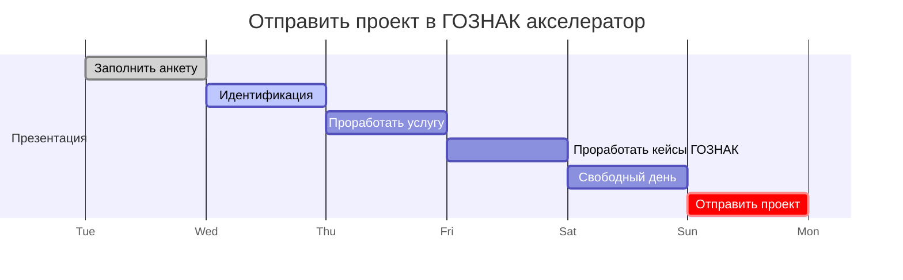

# civilization-of-machines

## Обзор

This project demonstrates a basic Hardhat use case. It comes with a sample contract, a test for that contract, and a script that deploys that contract.

Try running some of the following tasks:

```shell
npx hardhat help
npx hardhat test
REPORT_GAS=true npx hardhat test
npx hardhat node
npx hardhat run scripts/deploy.ts
```

## Установка

Для работы в репозитории нужно установить следующие плагины для редактора VSCode

- [Marp for VS Code](https://marketplace.visualstudio.com/items?itemName=marp-team.marp-vscode) - Редактор слайдов
- [Code Spell Checker](https://marketplace.visualstudio.com/items?itemName=streetsidesoftware.code-spell-checker) - проверка синтаксиса
- [Russian - Code Spell Checker](https://marketplace.visualstudio.com/items?itemName=streetsidesoftware.code-spell-checker-russian)
- [Solidity](https://marketplace.visualstudio.com/items?itemName=NomicFoundation.hardhat-solidity)
- [Markdown Preview Mermaid Support](https://marketplace.visualstudio.com/items?itemName=bierner.markdown-mermaid)

## Дорожная карта



## TODO

- [ ] отправить заявку до в ГОЗНАК до 26 декабря 2022
      Ссылка [Акселератор «Goznak Startup Lab»](https://accelerator.goznak.ru/)
- [x] Сделать анкету проекта
- [ ] Сделать презентацию проекта
- [x] Сделать анализ конкурентов
- [ ] Определить предполагаемый экономический эффект для ГОЗНАК
