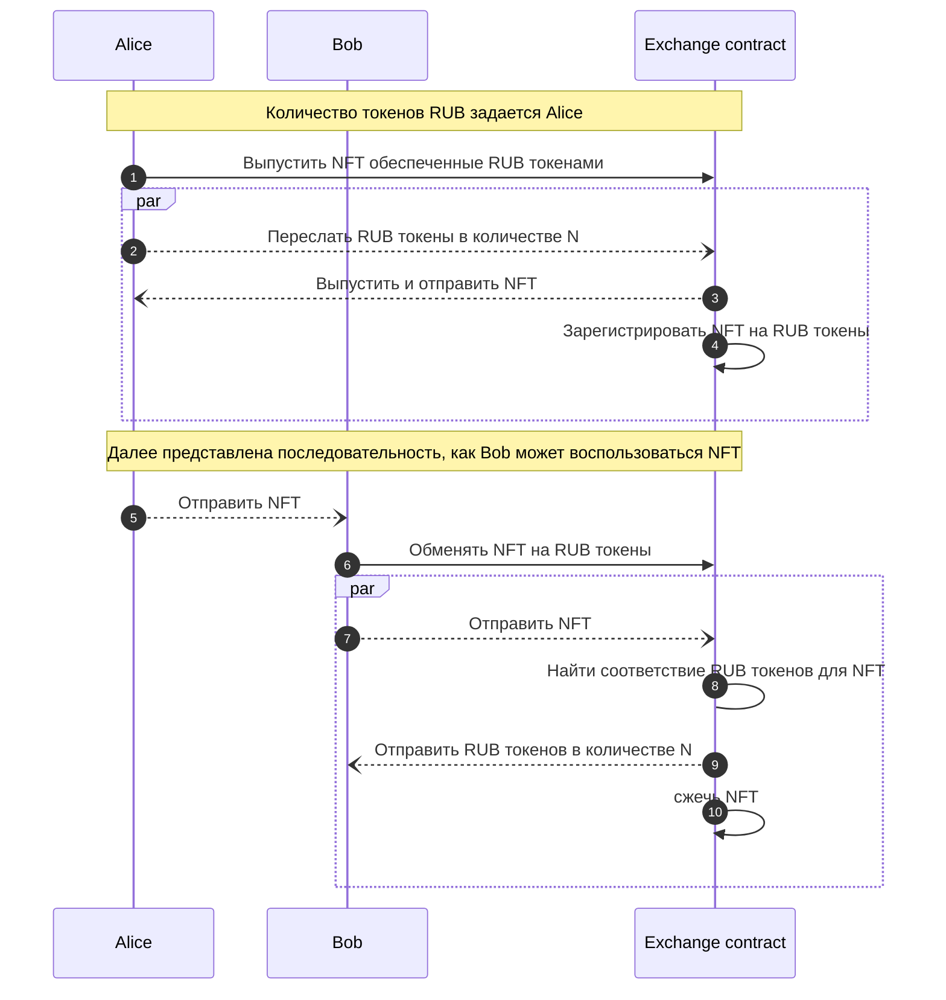
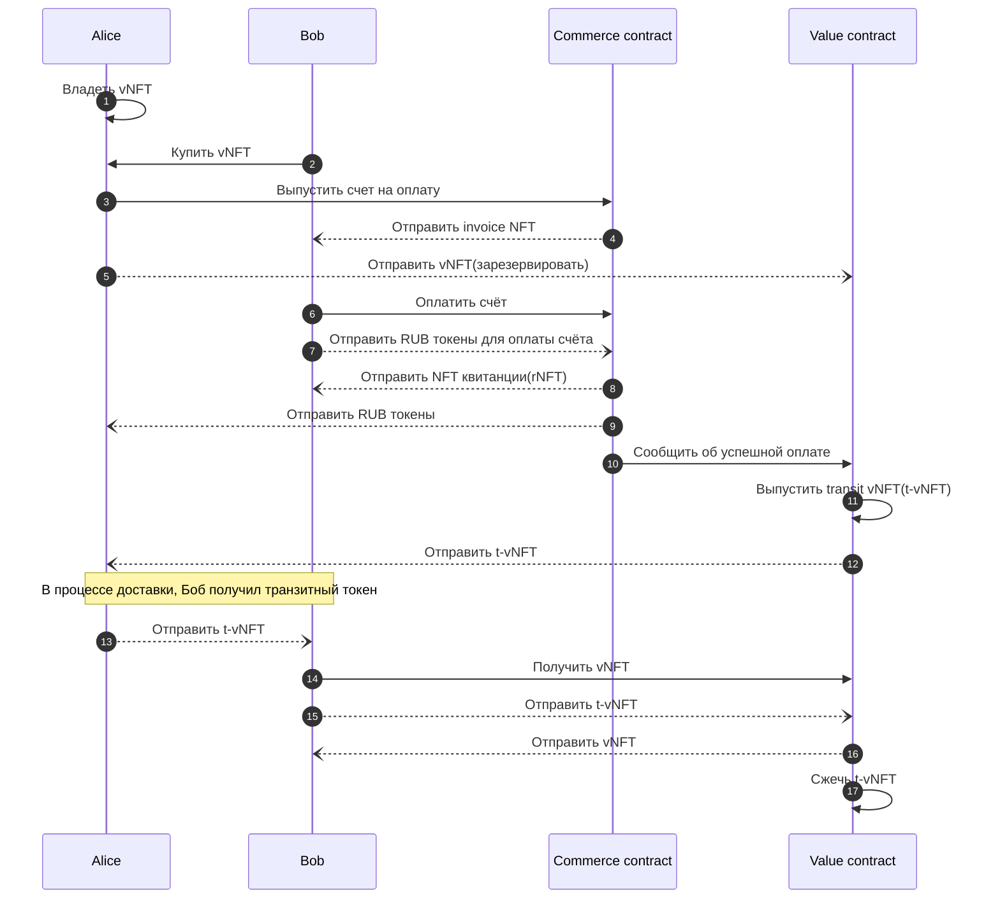
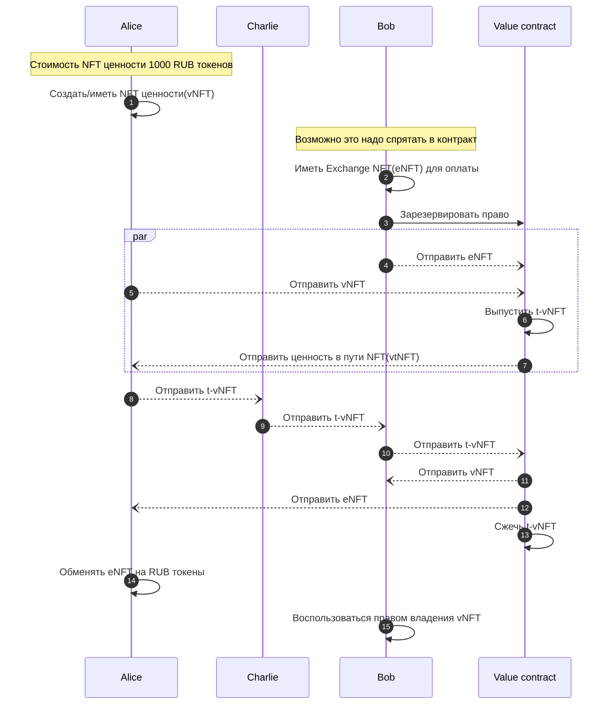

# Диаграммы

## NFT для обмена на токены RUB

Диаграмма не отражает вызовов методов на смарт контрактах NFT и RUB токена.

Взаимодействия с контрактами NFT и RUB токенов происходят неявно при _выпуске/движении/уничтожении_ токенов.

Смотреть [Депозитный сертификат](https://ru.wikipedia.org/wiki/%D0%94%D0%B5%D0%BF%D0%BE%D0%B7%D0%B8%D1%82%D0%BD%D1%8B%D0%B9_%D1%81%D0%B5%D1%80%D1%82%D0%B8%D1%84%D0%B8%D0%BA%D0%B0%D1%82).

## Счет на оплату(invoice) и квитанция

Боб хочет купить у Алисы NFT ценности. Для резервирования и гарантии платежа при доставке, Алиса выпускает счет на оплату.

Алиса может забрать NFT ценности из резервирования, если счет не оплачен во-время. Этот сценарий не представлен в диаграмме.

## Передача ценности

В этой диаграмме, Боб покупает у Алисы ценность. Ценность ассоциирована с токеном выпущенном Алисой. При покупке, Боб получает права на ценность, а Алиса оплату.

Алиса передает токен Бобу через Чарли. При том, что Чарли не должен иметь возможность владеть токеном.

