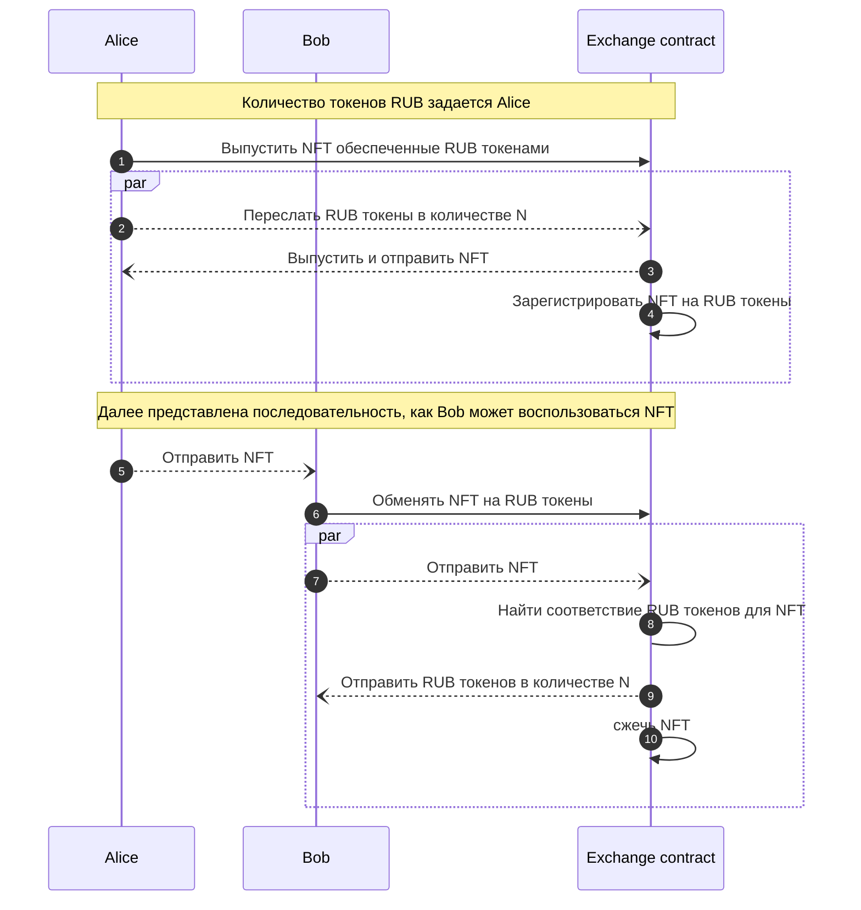

# NFT для обмена на токены RUB

Диаграмма не отражает вызовов методов на смарт контрактах NFT и RUB токена.

Взаимодействия с контрактами NFT и RUB токенов происходят неявно при _выпуске/движении/уничтожении_ токенов.

## Передача ценности
