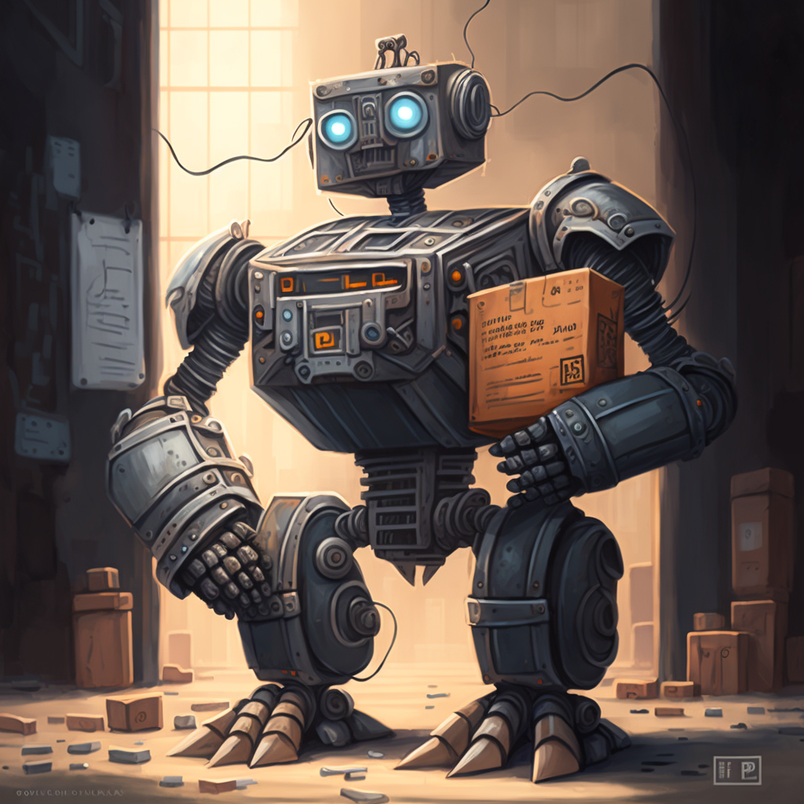
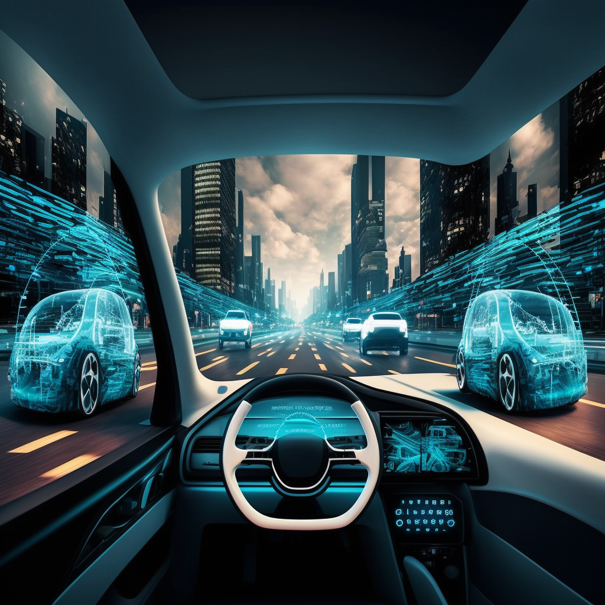
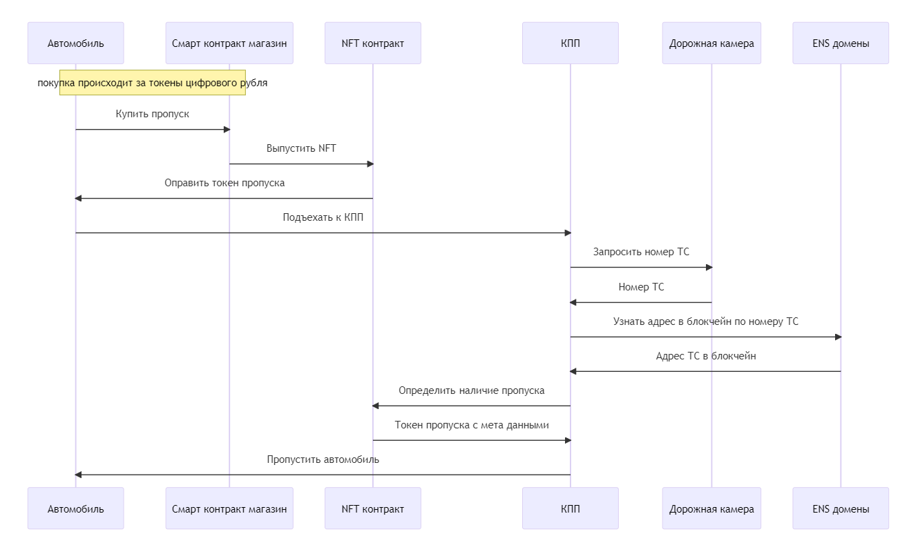

# Решения для цифровой экономики от Гознака.

Искандаров Эдуард

---

## Блокчейн для цифровых двойников

Работая с 2015 г. в крипто индустрии на разных позициях, в том числе CTO, я пришел к выводу что блокчейн технологии должны использоваться в первую очередь машиной.

---

# Слишком сложно и опасно для человека

Цифровые активы требуют умения и доступ к техническим средствам(крипто-кошельки, DeFi). В попытке упростить задачу для человека возникают централизованные биржи и кошельки.

❌ Централизация несет в себе риски с безопасностью(достаточно вспомнить недавнее закрытие FTX, но случаев гораздо больше!).

🙇‍♀️ Это неоправданно сложно и не удобно для людей.

---

# Но естественно для компьютерной программы

Программа в виде прошивки для автономного автомобиля, дрона или цифрового двойника может заключать договора 🤝 с другими программами через смарт-контракты.
👍 Это просто, надежно и безопасно.

---

# Варианты использования на примере автономного транспорта

Развитие цифровой экономики легко представить на примере автономного транспорта. Того как он взаимодействует с окружающим его физическим и цифровым миром.

1. Проезд автономного автомобиля по платной дороге.
2. Цепочка поставки автомобильного топлива и заправка автономного транспорта.

---

# Проезд по платной дороге

Для проезда по платной дорогое автомобилю нужно самостоятельно купить пропуск, и на КПП проверить наличие пропуска.

Для этого подойдет решение на основе NFT и смарт контракта.

---

---

# Проезд по платной дороге

На диаграмме последовательности видно, как автомобиль может купить пропуск, используя токены цифрового рубля на крипто-кошельке привязанном к машине. Контрольно-пропускной пункт используя регистрационный номер ТС определяет связь ТС с адресом в блокчейн и находит токен пропуска в виде NFT.

Ссылки на исходные коды представлены в слайде "Дополнение Б".

---

# Дополнение А

## Использованные инструменты

- [Hardhat](https://hardhat.org/) - среда разработки для Ethereum
- [TypeScript](https://www.typescriptlang.org/) - язык программирования прикладного уровня
- [Solidity](https://soliditylang.org/) - язык программирования смарт контрактов
- [OpenZeppelin Contracts](https://www.openzeppelin.com/contracts) - библиотеки для разработки смарт контрактов
- [ENS](https://github.com/ensdomains/ens-contracts) - библиотеки для доменной инфраструктуры
- [MidJourney](https://www.midjourney.com/home/) - нейросеть для генерации иллюстраций к презентации

---

# Дополнение Б

## Исходные коды для проезда по платной дороге

- [RUBXToken.sol](https://github.com/emcpow2/civilization-of-machines/blob/main/contracts/RUBXToken.sol) - смарт контракт для ERC20 токена цифрового рубля
- [TollPass.sol](https://github.com/emcpow2/civilization-of-machines/blob/main/contracts/TollPass.sol) - NFT(ERC0721) контракт для токенов пропуска
- [TollPassShop.sol](https://github.com/emcpow2/civilization-of-machines/blob/main/contracts/TollPassShop.sol) - смарт контракт магазина токенов пропуска
- Тесты и примеры использования
  - [RUBXToken.ts](https://github.com/emcpow2/civilization-of-machines/blob/main/test/RUBXToken.ts) - тесты токена цифрового рубля
  - [TollPass.ts](https://github.com/emcpow2/civilization-of-machines/blob/main/test/TollPass.ts) - тесты NFT пропуска и примеры их использования
  - [TollPassShop.ts](https://github.com/emcpow2/civilization-of-machines/blob/main/test/TollPassShop.ts) - тесты и примеры использования магазина в виде смарт контракта

---

# Дополнение В

## Исходные коды для
