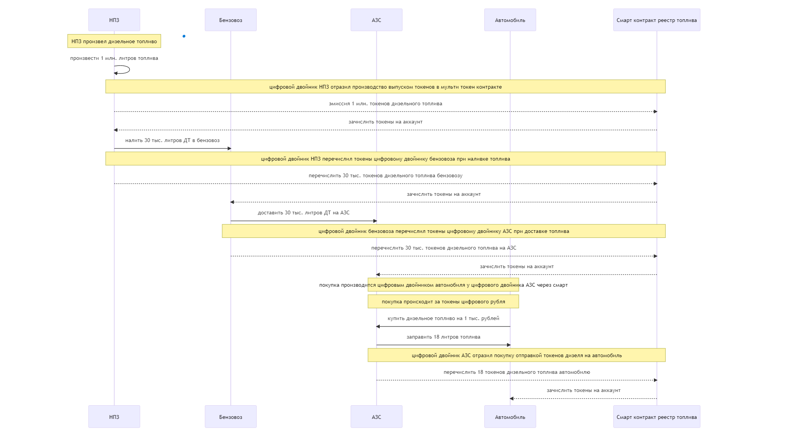

# Решения для цифровой экономики от Гознака.

Искандаров Эдуард

---

## Блокчейн для цифровых двойников

Работая с 2015 г. в крипто индустрии на разных позициях, в том числе CTO, я пришел к выводу что блокчейн технологии должны использоваться в первую очередь машиной.

---

# Слишком сложно и опасно для человека

Цифровые активы требуют умения и доступ к техническим средствам(крипто-кошельки, DeFi). В попытке упростить задачу для человека возникают централизованные биржи и кошельки.

❌ Централизация несет в себе риски с безопасностью(достаточно вспомнить недавнее закрытие FTX, но случаев гораздо больше!). Так же централизация выражается в создании изолированных экосистем крупных ИТ компаний.

🙇‍♀️ Это неоправданно сложно и не удобно для людей.

---

# Но естественно для компьютерной программы

Программа в виде прошивки для автономного автомобиля, дрона или цифрового двойника может заключать договора 🤝 с другими программами через смарт-контракты.
👍 Это просто, надежно и безопасно.

---

# Варианты использования на примере автономного транспорта

Развитие цифровой экономики легко представить на примере автономного транспорта. Того как он взаимодействует с окружающим его физическим и цифровым миром.

1. Проезд автономного автомобиля по платной дороге.
2. Цепочка поставки автомобильного топлива и заправка автономного транспорта.

---

# Проезд по платной дороге

Для проезда по платной дорогое автомобилю нужно самостоятельно купить пропуск, и на КПП проверить наличие пропуска.

Для этого подойдет решение на основе NFT и смарт контракта.

---

---

# Проезд по платной дороге

На диаграмме последовательности видно, как автомобиль может купить пропуск, используя токены цифрового рубля на крипто-кошельке привязанном к машине. Контрольно-пропускной пункт используя регистрационный номер ТС определяет связь ТС с адресом в блокчейн и находит токен пропуска в виде NFT.

Ссылки на исходные коды представлены в слайде "[Дополнение Б](#дополнение-б)".

---

# Цепочка поставки автомобильного топлива и заправка автономного транспорта

Мульти токены могут отражать обмен ресурсами цифровыми двойниками и служить основой их договоренностей в смарт контрактах.

Рассмотрим цепочку доставки и покупку топлива.

---

---

# Цепочка поставки автомобильного топлива и заправка автономного транспорта

На диаграмме последовательности видно, как материальные потоки предприятий и транспорта отражаются информационными потоками их цифровых двойников.

При этом важно отметить, что цифровые двойники работают независимо друг от друга. Благодаря технологиям блокчейн и токенизации есть уверенность что информацию и договоренности невозможно подделать.

На основе этого цифровые двойники могут строить правовые отношения.

Ссылки на исходные коды представлены в слайде "[Дополнение В](#дополнение-в)".

---

# Проблемы и пути их решений #1

Основная проблема связана с неразвитостью инфраструктуры, юридическим вакуумом и отсутствием признанных инструментов.

## Где хранить NFT метаданные?

NFT метаданные не хранятся в блокчейн. Блокчейн хранит только числовые идентификаторы токенов и ссылку на документ с метаданными в Интернет.

Хранилище метаданных это уязвимое место NFT технологии. В отличие от блокчейн, сервер с метаданными больше подвержен рискам атакой хакеров.

**❗ Рынку нужно надежное хранилище NFT метаданных.**

☝️ ГОЗНАК мог бы предложить такое хранилище на коммерческой основе.

---

# Проблемы и пути их решений #2

## Цифровая экономика или цифровые экосистемы?

На рынке есть несколько гигантов ИТ - Яндекс, Сбер, ВК и другие.

Каждый из них имеет возможность сформировать закрытую, изолированную экосистему.

В таком случае, решения на основе блокчейн не будут иметь смысла, ведь все может решиться внутри инфраструктуры каждой экосистемы.

Я считаю, что это нужно не допустить. Более открытая экономика на основе распределенных блокчейн технологий позволит маленьким компаниям предлагать свои продукты и услуги.

☝️ Нужна воля чтобы сделать равноправную цифровую экономику. Где ГОЗНАК выступит со стандартами, которые игроки на рынке смогли бы принять.

---

# Проблемы и пути их решений #3

## Блокчейн оракулы

Чтобы совершать сделки в смарт контрактах, нужно чтобы они владели информацией о реальном мире.

_Смотреть (https://ethereum.org/en/developers/docs/oracles/)._

Например курсы валют, стоимость товаров, наличие товаров.

Все это возможно сделать с помощью поставки данные в блокчейн. Так как, отправка данных требует оплаты комиссии за транзакцию, такие сервисы могут предоставляться только на коммерческой основе.

☝️ ГОЗНАК может разработать сервисы поставки данных в блокчейн.

---

# Проблемы и пути их решений #4

## Где искать документацию?

Смарт контракты это программы. Разрабатывать их будут разработчики ПО. Но чтобы делать это быстро - нужна хорошая документация.

Нужно чтобы кто то довольно авторитетный выступил хабом для хорошей документации для разработчиков. Примером может быть [Mozilla Development Network](https://developer.mozilla.org/).

Монетизация тут может быть - созданием подписки на платные материалы, хотя желательно максимально сохранить открытость.

---

# Проблемы и пути их решений. Заключение

Разрабатывать продукты для цифровой экономики относительно просто.

С другой стороны, в условиях формирования рынка нужны готовые и проверенные инструменты разработки, документация, вспомогательные сервисы, обучающие программы, консенсус рынка чтобы это заработало.

Все это надо собирать, строить и продвигать. Быть в тесном контакте с разработчиками, пользователями и понимать потребности рынка.

Потребности рынка до конца не понятны. Но если у разработчиков будет неопределенность юридическая, и/или техническая, то эффективной цифровой экономики не получится.

---

# Дополнение А

## Использованные инструменты

- [Hardhat](https://hardhat.org/) - среда разработки для Ethereum
- [TypeScript](https://www.typescriptlang.org/) - язык программирования прикладного уровня
- [Solidity](https://soliditylang.org/) - язык программирования смарт контрактов
- [OpenZeppelin Contracts](https://www.openzeppelin.com/contracts) - библиотеки для разработки смарт контрактов
- [ENS](https://github.com/ensdomains/ens-contracts) - библиотеки для доменной инфраструктуры
- [MidJourney](https://www.midjourney.com/home/) - нейросеть для генерации иллюстраций к презентации

---

# Дополнение Б

## Исходные коды для проезда по платной дороге

- [RUBXToken.sol](https://github.com/emcpow2/civilization-of-machines/blob/main/contracts/RUBXToken.sol) - смарт контракт для ERC20 токена цифрового рубля
- [TollTicket.sol](https://github.com/emcpow2/civilization-of-machines/blob/main/contracts/TollTicket.sol) - NFT(ERC0721) контракт для токенов пропуска
- [TollTicketShop.sol](https://github.com/emcpow2/civilization-of-machines/blob/main/contracts/TollTicketShop.sol) - смарт контракт магазина токенов пропуска
- Тесты и примеры использования
  - [RUBXToken.ts](https://github.com/emcpow2/civilization-of-machines/blob/main/test/RUBXToken.ts) - тесты токена цифрового рубля
  - [TollTicket.ts](https://github.com/emcpow2/civilization-of-machines/blob/main/test/TollTicket.ts) - тесты NFT пропуска и примеры их использования
  - [TollTicketShop.ts](https://github.com/emcpow2/civilization-of-machines/blob/main/test/TollTicketShop.ts) - тесты и примеры использования магазина в виде смарт контракта

---

# Дополнение В

## Исходные коды для цепочка поставки топлива и покупки

- [FuelRegistry.sol](https://github.com/emcpow2/civilization-of-machines/blob/main/contracts/FuelRegistry.sol) - смарт контракт для ERC1155 мульти токена топлива
- [FuelStation.sol](https://github.com/emcpow2/civilization-of-machines/blob/main/contracts/FuelStation.sol) - смарт контракт АЗС для продажи топлива
- Тесты и примеры использования
  - [FuelRegistry.ts](https://github.com/emcpow2/civilization-of-machines/blob/main/test/FuelRegistry.ts) - тесты мульти токена топлива и примеры его использования
  - [FuelStation.ts](https://github.com/emcpow2/civilization-of-machines/blob/main/test/FuelStation.ts) - тесты и примеры использования АЗС в виде смарт контракта
