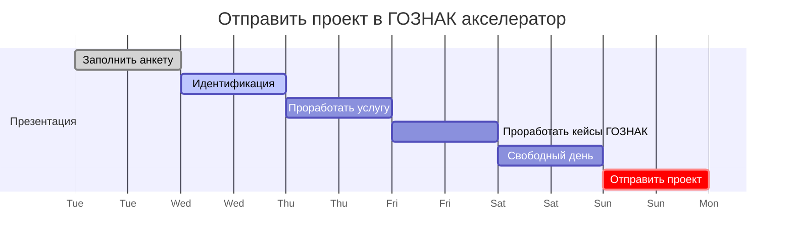

## Дорожная карта

## TODO

- [x] отправить заявку до в ГОЗНАК до 26 декабря 2022
      Ссылка [Акселератор «Goznak Startup Lab»](https://accelerator.goznak.ru/)
- [x] Сделать анкету проекта
- [x] Сделать презентацию проекта
- [x] Сделать анализ конкурентов
- [x] Определить предполагаемый экономический эффект для ГОЗНАК
- [x] Переименовать `gas` в `fuel`
- [x] Разместить на GitHub Pages
- [x] Добавить комментарии на русском в тесты
- [x] Переименовать FuelStationSKU и TollPass контракты

## Полезная информация

- [Deploying ENS on a Private Chain](https://docs.ens.domains/deploying-ens-on-a-private-chain)
- [The Convergence Ecosystem in Mobility](https://outlierventures.io/wp-content/uploads/2019/05/ov0382convergenceinmobilitys1-180911161035.pdf)
- [Автомобиль, Интернет вещей и прочие технологии](https://habr.com/ru/company/unet/blog/371207/)
- [Что такое «умные» дороги и как будет выглядеть цифровой транспорт](https://trends.rbc.ru/trends/industry/5ef0c7849a7947bad518dfb5)
- [NFTs, blockchain, AI, drones and autonomous vehicles key to more resilient supply chains](https://www.rmit.edu.au/news/all-news/2022/may/digital-cbd-report-3)
- [Spend ERC-20 Create ERC-721](https://github.com/fulldecent/spend-ERC20-create-ERC721)
- [Is this possible to pay for ERC721 token with ERC20 token not ETH?](https://ethereum.stackexchange.com/questions/112301/is-this-possible-to-pay-for-erc721-token-with-erc20-token-not-eth)
- [A Long Way To Go: On Gasless Tokens and ERC20-Permit](https://soliditydeveloper.com/erc20-permit)
