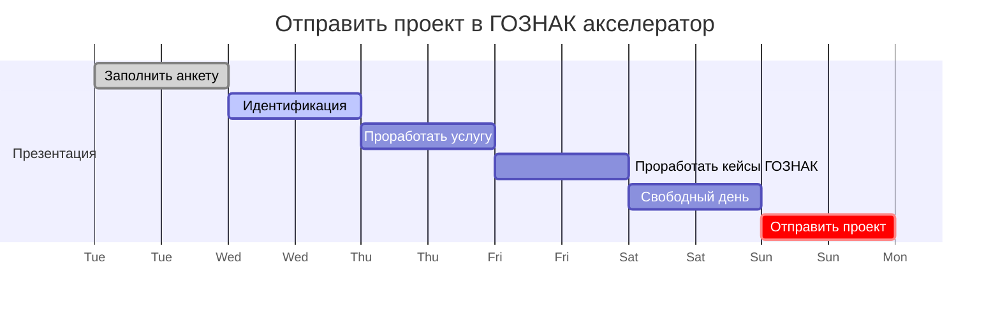

## Дорожная карта

## TODO

- [ ] отправить заявку до в ГОЗНАК до 26 декабря 2022
      Ссылка [Акселератор «Goznak Startup Lab»](https://accelerator.goznak.ru/)
- [x] Сделать анкету проекта
- [ ] Сделать презентацию проекта
- [x] Сделать анализ конкурентов
- [ ] Определить предполагаемый экономический эффект для ГОЗНАК
- [x] Переименовать `gas` в `fuel`
- [ ] Разместить на GitHub Pages
