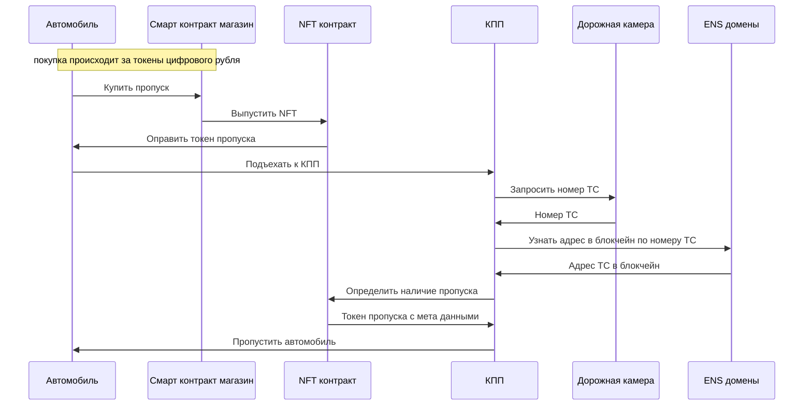

# Проезд по платной дороге. Последовательность

```mermaid
sequenceDiagram
  participant A as Автомобиль
  participant SCH as Смарт контракт магазин
  participant NFT as NFT контракт
  participant KPP as КПП
  participant CAM as Дорожная камера
  participant ENS as ENS домены

  note over A,SCH: покупка происходит за токены цифрового рубля
  A->>SCH: Купить пропуск

  SCH->>NFT: Выпустить NFT
  NFT->>A: Оправить токен пропуска
  A->>KPP: Подъехать к КПП
  KPP->>CAM: Запросить номер ТС
  CAM->>KPP: Номер ТС
  KPP->>ENS: Узнать адрес в блокчейн по номеру ТС
  ENS->>KPP: Адрес ТС в блокчейн
  KPP->>NFT: Определить наличие пропуска
  NFT->>KPP: Токен пропуска с мета данными
  KPP->>A: Пропустить автомобиль
```
