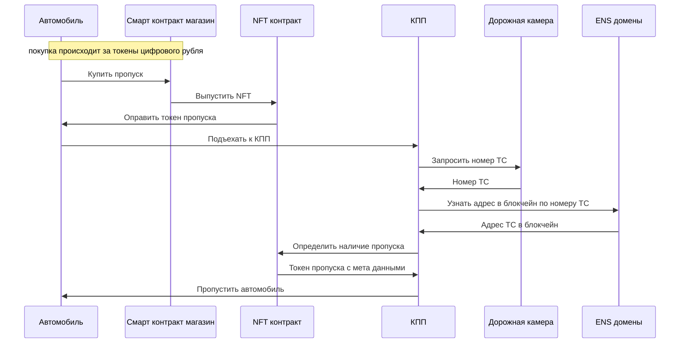

# Диаграммы для презентации

## Проезд по платной дороге. Последовательность



## Цепочка поставки топлива и покупка

```mermaid
sequenceDiagram
  participant OF as НПЗ
  participant FT as Бензовоз
  participant OS as АЗС
  participant A as Автомобиль
  %% participant SCOS as Смарт контракт АЗС
  participant FR as Смарт контракт реестр топлива

  note over OF: НПЗ произвел дизельное топливо
  OF->>OF: произвести 1 млн. литров топлива

  note over OF,FR: цифровой двойник НПЗ отразил производство выпуском токенов в мульти токен контракте
  OF-->>FR: эмиссия 1 млн. токенов дизельного топлива
  FR-->>OF: зачислить токены на аккаунт

  OF->>FT: налить 30 тыс. литров ДТ в бензовоз
  note over OF,FR: цифровой двойник НПЗ перечислил токены цифровому двойнику бензовоза при наливке топлива
  OF-->>FR: перечислить 30 тыс. токенов дизельного топлива бензовозу
  FR-->>FT: зачислить токены на аккаунт

  FT->>OS: доставить 30 тыс. литров ДТ на АЗС
  note over FT,FR: цифровой двойник бензовоза перечислил токены цифровому двойнику АЗС при доставке топлива
  FT-->>FR: перечислить 30 тыс. токенов дизельного топлива на АЗС
  FR-->>OS: зачислить токены на аккаунт

  note over A,OS: покупка производится цифровым двойником автомобиля у цифрового двойника АЗС через смарт 

  note over A,OS: покупка происходит за токены цифрового рубля
  A->>OS: купить дизельное топливо на 1 тыс. рублей
  OS->>A: заправить 18 литров топлива
  note over OS,FR: цифровой двойник АЗС отразил покупку отправкой токенов дизеля на автомобиль
  OS-->>FR: перечислить 18 токенов дизельного топлива автомобилю
  FR-->>A: зачислить токены на аккаунт
